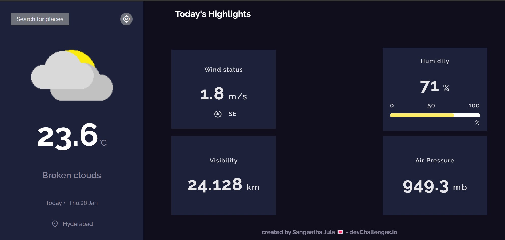

# weather-api
(part of devchallenges 6th challenge).

## Table of Contents

- [Links](#links)
- [Description](#description)
- [Challenges involved](#challenges-involved)
- [Project Set Up](#project-set-up)

## Links

[Live Link](https://sangeetha-jula-weather-api.netlify.app/)  |
[Challenge Link](https://devchallenges.io/challenges/mM1UIenRhK808W8qmLWv")

<div>
    
    
</div>    


## Description

<div>
    This challenge is done using the react library ,used the react redux toolkit formaintaining the state of this application,used weatherbit api for fetching the weatherdetails.and Geo DB city api for fetching the cities based on the user search city.
</div>
<div>
    <ul>react hooks used are:
        <li>useState</li>
        <li>useEffect</li>
    </ul>
    <ul>concepts like :
        <li>redux</li>
        <li>styled components</li>
    </ul>
</div>

## Challenges involved

<div>
    I can see city weather as default, preferably my current location
    I can search for city
    I can see weather of today and the next 4 days
    I can see the date and location of the weather
    I can see according to image for each type of weather
    I can see the min and max degree each day
    I can see wind status and wind direction
    I can see humidity percentage
    I can see a visibility indicator
    I can see the air pressure number
    I can request my current location weather
    I can convert temperature in Celcius to Fahrenheit and vice versa
</div>

## Project Set Up
 <p>steps:</p>

```bash

    git clone https://github.com/sangeetha-13-99/weather-api.git
    # open the terminal and type below commands.
    # for installing the packages and adding node modules file
    npm install
    # for installing the local server
    npm run dev    
    #add the .env file and add the respective variables for accessing the inside thefiles.
    #for creating the build folder
    npm run build  

 ```       